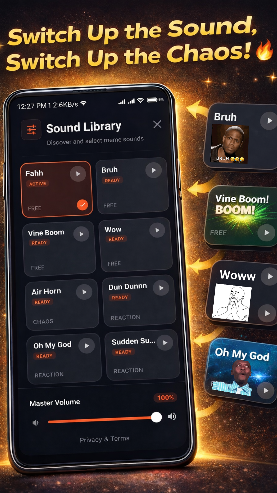
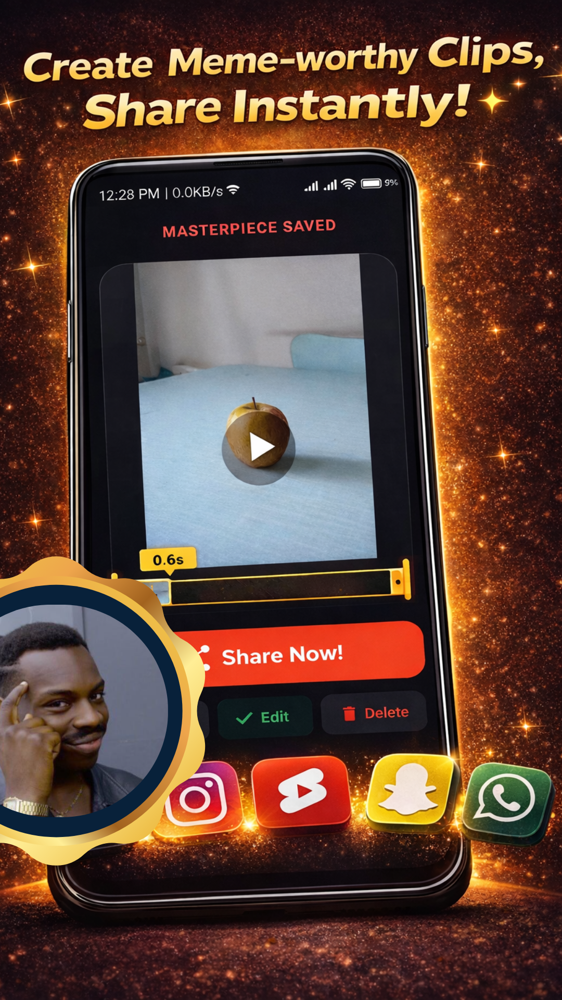

<p align="center">
  
</p>

<h1 align="center">Fahh</h1>

<p align="center"><b>The meme sound reaction camera.</b></p>

<p align="center">
  Press a big red button. A meme sound blasts through your speaker.<br/>
  Your camera is already rolling. Your friend's face is priceless.<br/>
  Share it everywhere.
</p>

---

<p align="center">
  
  
  
  
  
</p>

---

### What makes this different

Every soundboard app lets you press buttons alone in your room. Fahh plays the sound **while you're recording video** — so the reaction is captured live. No post-editing, no syncing audio in a video editor. Just press, record, share.

---

### Features

- **35 bundled reaction sounds** with four free starters and optional one-sound rewarded unlocks
- **Live sound + camera** — sound plays through speaker during recording
- **3D button** — spring physics, haptic feedback, particle burst
- **Trim & rotate** — edit clips without leaving the app
- **Instant share** — TikTok, Reels, Shorts, Snapchat, WhatsApp
- **Made with Fahh** — a small corner watermark helps shared clips lead people back to the app
- **No account, no sign-up, works offline**

---

### Tech

- Kotlin + Jetpack Compose
- Material 3
- CameraX for video recording
- Hilt for dependency injection
- Room for local persistence
- DataStore for preferences
- Google AdMob rewarded ads for optional sound and custom-slot unlocks
- MediaMuxer for video trimming with rotation metadata
- Media3 Transformer for fail-safe video watermarking

Min SDK 24 · Target SDK 35

---

### Build

```bash
# Debug
./gradlew assembleDebug

# Release AAB (requires signing env vars)
FAHH_KEYSTORE_PATH=<absolute-path-to-upload-keystore> FAHH_KEYSTORE_PASSWORD=<password> FAHH_KEY_ALIAS=<alias> FAHH_KEY_PASSWORD=<password> ./gradlew bundleRelease
```

---

### Project structure

```
app/src/main/java/com/fahh/
├── audio/          # SoundManager — SoundPool wrapper
├── camera/         # CameraManager — CameraX recording
├── data/
│   ├── database/   # Room DB + DAO for sounds
│   ├── model/      # Sound data class
│   └── repository/ # SoundRepository, SettingsRepository
├── ui/
│   ├── components/ # SoundButton, SoundGrid, SidebarMenu, ParticleBurst
│   ├── screens/    # Main, Camera, Share, Trim, Onboarding, Privacy, AdTransition
│   └── theme/      # Colors, typography, glass modifiers
├── utils/          # AdManager, ShareUtils, VideoTrimUtils
├── viewmodel/      # SoundViewModel, CameraViewModel
├── FahhApplication.kt
└── MainActivity.kt
```

---

### License

All rights reserved.
