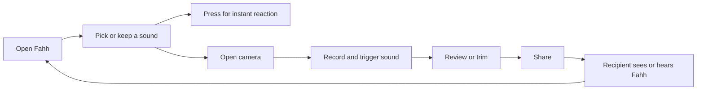

# Fahh Premium Update: Product, Monetization, UX, and Release Plan

**Prepared:** July 10, 2026
**Repository:** `C:\coding\Fahh`
**Current app version in source:** `1.0.6` (`versionCode 7`)
**Purpose:** Give a lower-cost implementation model enough product, technical, policy, and release context to execute the next updates without redoing discovery.

> **Product decision update, July 10, 2026:** Fahh 1.1.0 will not sell a subscription, lifetime unlock, or any paid feature. The complete experience remains financially free. Rewarded ads may unlock optional convenience features such as My Sounds, but users will always have a free path to the core app, recording, editing, sharing, and sound library. Revisit paid products only after retention and user feedback demonstrate that they would add real value.

## 1. Executive recommendation

## 1.1 Implemented 1.1.0 scope and deliberate deferrals

This document began as a broad exploration, including paid products and an eventual
global leaderboard. The owner chose a more generous release. The executable scope
for **Fahh 1.1.0** is therefore the following:

| Area | Status | Release decision |
|---|---|---|
| Safe catalog IDs, upgrade migration, and preservation of unlocks | Complete | Existing unlocks are preserved while the built-in catalog can grow safely. |
| Copyright gate for downloaded sounds | Complete process | No staged download is shipped unless its commercial redistribution right is documented. Four deliberately removed files stay removed. |
| Forced recording-flow interstitials | Complete | Removed. A saved recording opens straight into review. |
| Total lifetime button presses | Complete | A prominent local `FAHHS` counter provides a small bragging right without collecting user data. |
| My Sounds | Complete | One voluntary rewarded ad unlocks local microphone recordings permanently on that device; users can keep up to five private clips. |
| Sound discovery | Complete for the current catalog | The swipe drawer remains a one-swipe, one-tap sound picker and includes My Sounds. A 50-plus-sound search/pin library waits until cleared sound assets actually make that necessary. |
| Paid subscription/lifetime unlock | Deliberately deferred | No paid feature ships in 1.1.0. Do not imply a future price rise or use urgency tactics. |
| Login, Google OAuth, Supabase, global leaderboard | Deliberately deferred | These require a backend, abuse controls, privacy disclosures, deletion pathways, and moderation. They are not required for this local, free release. |
| Firebase analytics, Crashlytics, Remote Config | Deferred pending owner setup | Requires a Firebase project and an updated privacy/Data Safety review. |
| Watermark/export branding, widget, local challenge card | Deferred | Useful follow-up experiments after this release proves stable. |

### What must still happen outside code before Play production

1. Add only sounds with written commercial redistribution permission to the rights
   ledger, then run device-level audio and content-rating QA.
2. Install the release candidate on at least one old Android device and one current
   device, exercising microphone permission, rewarded-ad failure/dismissal, five
   custom clips, deletion, sound selection, camera recording, trim, and share.
3. Build a signed release AAB with the externalized upload key, incrementing from
   the version code already live in Play Console if `8` is not unused.
4. Re-check the Play Console policy forms and run an internal/closed rollout before
   production. Do not add an account, analytics SDK, paid product, cloud audio, or
   leaderboard without reopening those privacy and policy decisions.

Fahh should remain a generous free reaction camera and add a clear convenience upgrade, not become an ad-heavy soundboard.

The recommended business model is:

1. Keep the core app, camera, trim, share, several useful sounds, and individual rewarded unlocks free.
2. Remove forced interstitials from the creation flow. Rewarded unlock ads already produce most revenue and are user-chosen.
3. Add **Fahh Pro Annual** at a founding price around **US $8.99 per year**, with the full annual charge and auto-renewal stated clearly.
4. Also test **Fahh Pro Forever** around **US $19.99 once** for users who dislike subscriptions. If the team cannot promise recurring sound drops, launch the one-time product first and delay the subscription.
5. Make Pro valuable through all current sounds, future sound drops, no need to watch unlock ads, expanded quick-deck tools, expanded custom-sound slots, and optional Fahh branding controls.
6. Do not require an account for purchasing or restoring Pro. Google Play can restore entitlements for the same Play account.
7. Redesign the sound drawer into a full sound library that can comfortably handle 30 to 100 sounds.
8. Add analytics before relying on conversion guesses. “6,000 installs” is not the same as monthly active users.
9. Build a local combo challenge and shareable score card before building a global leaderboard. Add anonymous global competition only after retention data shows demand.
10. Treat every downloaded sound as legally unapproved until its source and usage rights are documented.

### The next public release

Target **Fahh 1.1.0: Sound Drop**. It should include:

- A safe catalog migration that gives existing users new sounds without erasing earned unlocks.
- A scalable full-screen sound library with categories, favorites, search, preview, and clear unlock choices.
- A curated subset of the staged sounds after rights, content-rating, audio, and QA checks.
- Analytics, Crashlytics, and purchase funnel events.
- Google Play Billing and restore-purchase support.
- Removal of forced interstitials from the record-to-share path.
- Preservation of all existing unlocks.
- Fixes for the current unfinished March update and its stale tests.

Do **not** put global accounts, a global leaderboard, remote user audio, and a brand-new video transcoding pipeline into the same first release. Those create four separate failure and policy surfaces.

## 2. What exists today

### Public product position

The live Play listing presents Fahh as a meme sound reaction camera, not merely a soundboard. The public listing currently shows the `5K+` download tier, a `5.0` rating, and 227 public reviews. The owner's more recent Play Console numbers, approximately 6,000 users and 290+ five-star reviews, should be used for internal planning because public counters lag.

The strongest product promise is: **play the sound while the camera records, then share the reaction immediately.** Keep this promise at the center of every update.

### Current technical stack

- Kotlin and Jetpack Compose with Material 3.
- CameraX recording.
- Room for the sound list and unlock flags.
- DataStore for settings, counts, streaks, and milestones.
- AdMob rewarded and interstitial ads.
- User Messaging Platform consent flow.
- MediaMuxer-based trim and rotation.
- Navigation Compose in the unfinished working tree.
- No Play Billing dependency.
- No analytics, Crashlytics, remote configuration, authentication, or backend.

### Current free and locked catalog

The code defines 12 sounds. Four are free: Fahh, Bruh, Vine Boom, and Wow. Eight start locked and are unlocked one at a time with a rewarded ad.

Current behavior includes:

- Two in-session previews of a locked sound.
- One rewarded ad to permanently unlock that sound on the current device.
- Local favorite or last-selected sound persistence.
- Local daily streak, total button press count, and 12 combo milestones.
- Gallery, onboarding, rating prompt, settings, coming-soon page, and tip jar work in the dirty tree.
- A saved `watermarkEnabled` preference that is not connected to video processing.

### Important repository state

The working tree is not a clean release baseline:

- 22 tracked files contain about 1,340 additions and 471 deletions.
- Several screens, navigation files, settings components, image assets, and documentation files are untracked.
- `git diff --check` is clean, but that only checks patch whitespace and conflict markers.
- Two Gradle test attempts did not complete within 60 and 120 seconds, so the current build is not verified.
- `SoundViewModelTest.kt` is visibly stale. It constructs `SoundViewModel(application)` even though the production constructor now needs four injected arguments. The test also imports libraries not declared in `app/build.gradle.kts`.

Treat the dirty March work as user-owned. Do not reset or discard it. Create a named checkpoint before implementation.

## 3. Critical findings to solve before adding sounds

| Severity | Finding | Why it matters | Required action |
|---|---|---|---|
| P0 | New sounds are only inserted when the database is empty | All existing users have a non-empty DB, so they will never receive newly bundled sounds | Replace one-time seeding with versioned catalog sync |
| P0 | Room uses auto-generated numeric IDs and sound names as update keys | Renames and additions are fragile; unlock state can be lost or attached incorrectly | Add stable string `soundId` values and separate catalog metadata from user progress |
| P0 | `.fallbackToDestructiveMigration()` is enabled | A future schema bump may erase local unlocks | Write and test a real Room migration |
| P0 | Signing password appears in tracked `STORE_LISTING.md` | Anyone with the file and keystore could sign an upload | Remove the secret, assess repository exposure, rotate the upload key/password if needed |
| P0 | Release keystore exists in the project folder | It is ignored, not tracked, but still at risk from copying or backup | Move it outside the repo and back it up securely |
| P0 | Current tests are stale and the build is unverified | Shipping on top of an unknown baseline risks breaking 6,000 users | Repair tests, run debug and release builds, then create a baseline commit |
| P0 | Unlock dialog says “pack” while code unlocks one sound | This is misleading at the exact monetization decision | Change copy and product model to match the delivered entitlement |
| P0 | Recording 20 onward triggers an interstitial after every recording | It punishes the most engaged creators and interrupts review of their clip | Remove this schedule from `onRecordingFinished()` |
| P1 | Unlocks are local only | Reinstalling or changing devices loses rewarded unlocks | Preserve local unlocks; explain the limitation; use Play Billing restore for purchased Pro |
| P1 | Watermark setting has no effect | UI promises a control that does nothing | Hide it until Media3 export exists or implement it fully |
| P1 | Store copy promises “No watermark” | A forced watermark would be a user-visible regression | Keep watermark optional and update listing only when behavior is truthful |
| P1 | No analytics or crash reporting | Revenue and feature decisions are guesses | Add instrumentation before running monetization experiments |
| P1 | `new_sounds` contains long clips and mixed audio formats | Current `SoundPool` path is best for short effects; long sounds can fail or behave badly | Normalize, trim, and route long sounds through an appropriate player |
| P1 | The tip jar opens Buy Me a Coffee | A true tip with no digital benefit can be allowed, but policy and regional payment rules change | Keep it purely optional with no digital reward; review policy before every release |
| P1 | Some staged audio appears to contain profanity, celebrity audio, music, or branded characters | Rights, trademark, and Everyone-rating risk can remove or re-rate the app | Use a content-rights gate and exclude risky files until cleared |

### Credential response checklist

1. Remove the real password from `STORE_LISTING.md` and replace it with placeholders.
2. Check whether the Git repository has ever been pushed, zipped, shared, or backed up to a shared service.
3. If exposed, request an upload-key reset in Play Console if Google Play App Signing is enabled.
4. Generate a new upload keystore and use a new strong password.
5. Store secrets in a password manager or CI secret store, never in Markdown or Gradle source.
6. Move `fahh-release.jks` outside `C:\coding\Fahh`.
7. Verify that the Play App Signing key is safe. Do not confuse the replaceable upload key with Google's app signing key.

## 4. Product strategy

### Core loop



Every feature should improve one of these steps. A leaderboard, account, or paywall that does not improve the loop should wait.

### Product principles for monetization

- **Never charge before delight.** Let a new user play free sounds and record before presenting Pro.
- **Never relock an earned sound.** Existing device unlocks survive catalog and billing migrations.
- **Never block the saved clip.** A failed ad, purchase check, analytics call, or watermark export must not strand a user's video.
- **Rewarded means chosen.** The user explicitly requests the ad in exchange for a named sound.
- **Pro removes friction.** It does not remove the basic ability to create.
- **No fake urgency.** Use a founding price only if it is real, configured, and honored.
- **No launch paywall.** The highest-intent trigger is a locked sound, not app open.

## 5. Recommended monetization model

### Tier matrix

| Capability | Free | Fahh Pro Annual | Fahh Pro Forever |
|---|---|---|---|
| Core sound button | Included | Included | Included |
| Camera, trim, gallery, share | Included | Included | Included |
| Useful starter sounds | Included | Included | Included |
| Locked sound preview | 2 previews per sound per session or a clearly defined reset | Unlimited | Unlimited |
| Individual sound unlock | 1 rewarded ad, permanent on that device | All unlocked | All unlocked |
| Current premium catalog | Earn one by one | Included | Included |
| Future regular sound drops | Earn one by one | Included while active | Included if the product promise explicitly says so |
| Forced interstitials | None recommended | None | None |
| Rewarded ads | Only when user chooses an unlock or export option | Not needed for catalog | Not needed for catalog |
| Quick deck / favorites | Pin up to 6 sounds to the swipe sidebar | Expanded deck and presets | Expanded deck and presets |
| Custom local sounds | Watch 1 rewarded ad once to unlock My Sounds, then record and keep up to 5 local sounds | Included immediately with expanded local slots | Included immediately with expanded local slots |
| Fahh branding on export | Optional, never silently forced on existing users | User controlled | User controlled |
| Restore purchase | Not applicable | Required | Required |

### Pricing recommendation

Start with Play Console regional pricing and always display the localized price returned by Google Play. Never hardcode `$8.99` into the button.

- **Annual:** approximately US $8.99 per year.
- **Lifetime:** test approximately US $19.99 once.
- **No monthly plan at launch.** It adds choice and churn without proving demand.
- **No free trial initially.** The free tier is already the trial and is easier to understand.

If the team cannot commit to a documented cadence such as one curated sound drop every month, do not sell recurring access yet. Launch a one-time “Fahh All Access” product around US $9.99 to $14.99 and introduce the annual product only when recurring value exists.

Google Play requires subscriptions to provide sustained or recurring value. “Unlock the current sounds once” is a one-time benefit and should be sold as a one-time product, not disguised as a subscription.

### Paywall copy

Recommended structure:

> **Every sound. Every new drop.**
> Unlock the full Fahh library, skip sound-unlock ads, and get Pro creator tools.
> **[localized annual price] billed yearly. Auto-renews. Cancel anytime in Google Play.**
> [Start Fahh Pro]
> [Get Pro Forever for localized price]
> [Continue free]
> Restore purchases · Terms · Privacy

If a founding price is real:

> Founding price for early supporters. Keep this price while your subscription remains active.

Do not use:

- “The app is going viral, price rises tonight” unless both claims and deadline are real.
- Fake countdown timers.
- Preselected consent or purchase controls.
- A hidden close button.
- A monthly equivalent as the largest price when the user is charged annually.

### Best paywall triggers

Show the paywall only at high-intent, non-destructive moments:

1. After a user taps a locked sound and has already heard a preview.
2. As the second option beside “Watch 1 ad to unlock this sound forever.”
3. After the user earns a second or third rewarded unlock: “You clearly like Fahh. Want the whole library?”
4. From a visible “Fahh Pro” row in Settings.
5. When the user chooses a Pro-only creator tool.

Do not show it:

- On first launch.
- Before the first sound press.
- While recording.
- Before showing the newly recorded clip.
- Every time the app resumes.

### Rewarded unlock screen

Replace the current generic alert with an inline or bottom-sheet choice:

> **Unlock Emotional Damage**
> Watch one short ad to keep this sound on this device.
> [Watch 1 ad]
> [Unlock every sound with Fahh Pro]
> Continue browsing

The reward description, scope, and persistence must be exact. If one ad unlocks one sound, never say pack.

### Rewarded custom-sound unlock

Custom sounds should be a meaningful one-time rewarded feature unlock, not an ad before every recording. The recommended free experience is:

1. User opens **My Sounds** from the library or quick sidebar.
2. They see what it does: record a short reaction sound, trim it, name it, and keep it privately on the device.
3. They watch **one rewarded ad** to unlock My Sounds permanently on that device.
4. They can save up to five custom sounds and pin any of them to the swipe sidebar.
5. When all five slots are used, offer delete/replace. Do not force another ad merely to edit or replay a sound they already own.

Pro bypasses the rewarded unlock and lifts the slot cap. This keeps the free path generous, creates a voluntary rewarded placement with much higher perceived value than a generic ad, and gives Pro a convenience benefit without taking creation away from free users.

Suggested unlock copy:

> **Make Fahh yours**
> Record and save your own reaction sounds. Watch one ad to unlock My Sounds on this device.
> [Watch 1 ad and unlock]
> [Get Fahh Pro, no ad needed]
> Not now

### Interstitial decision

Recommended action: remove all forced interstitials for 1.1.0.

Reasons:

- Most reported revenue already comes from rewarded unlocks.
- The current schedule escalates to an interstitial after every recording for the most engaged users.
- The ad appears between capture and review, when the user is most anxious to see whether the moment was saved.
- AdMob guidance places interstitials at logical breaks. “Your clip just finished saving” is technically a transition, but it is a poor emotional break because it delays the user's result.

If the owner insists on retaining them, use Remote Config and all of these limits:

- Never before the user sees the saved clip.
- At most one per session and one per 24 hours.
- Only after the user leaves Share or Gallery.
- Never within the first three completed recordings.
- Disabled for Pro.
- Measured against D1 retention, completed recordings, shares, and review sentiment, not revenue alone.

### Revenue scenarios

Current ad revenue of about US $1/day is about US $365/year if flat. These examples are gross before Play fees, taxes, refunds, currency effects, and churn.

| Annual conversion from 6,000 users | Buyers | Gross at $8.99/year | Average gross per day over year |
|---:|---:|---:|---:|
| 0.5% | 30 | $269.70 | $0.74 |
| 1.0% | 60 | $539.40 | $1.48 |
| 2.0% | 120 | $1,078.80 | $2.96 |
| 3.0% | 180 | $1,618.20 | $4.43 |

These are not forecasts. The denominator should become monthly active users and paywall viewers after analytics is installed. A small conversion lift matters, but retention and new-user growth still dominate at this scale.

## 6. Sound catalog and ingestion plan

### Snapshot of `new_sounds`

The folder was actively changing during the audit. At the final snapshot it contained 16 MP3 files:

| File | Duration | Size | Initial disposition |
|---|---:|---:|---|
| `buzzer.mp3` | 1.25s | 19.0 KiB | Good length; verify rights and loudness |
| `crowd_laughing.mp3` | 5.18s | 128.3 KiB | Consider trim to 3 to 4 seconds |
| `drum_roll.mp3` | 4.23s | 132.4 KiB | Good candidate after rights check |
| `Emotional_Damage.mp3` | 3.40s | 53.2 KiB | High recognition, high voice-clip rights risk |
| `His_name_is_John_Cena.mp3` | 7.49s | 292.5 KiB | Music, voice, and trademark risk; do not ship uncleared |
| `Rizz_me_up.mp3` | 7.29s | 285.0 KiB | Trim and review content/source |
| `rizzer.mp3` | 11.69s | 274.0 KiB | Too long for current behavior; likely long-player path |
| `roblox_oof.mp3` | 0.94s | 22.0 KiB | Branded/copyright risk; do not ship uncleared |
| `Sad_Violin.mp3` | 22.46s | 702.0 KiB | Explicit user demand, but trim and clear music rights |
| `school_bell.mp3` | 4.73s | 92.5 KiB | Good generic candidate after source check |
| `spiderman_evil.mp3` | 13.66s | 213.4 KiB | Branded/copyright risk and too long |
| `Spooderman.mp3` | 7.65s | 299.1 KiB | Review source and trademark resemblance; trim |
| `ultra_suspense.mp3` | 9.20s | 287.5 KiB | Trim or long-player path; clear music rights |
| `uWu.mp3` | 0.72s | 11.2 KiB | Good length; verify content and source |
| `Why_are_you_running.mp3` | 2.66s | 104.2 KiB | High recognition, likely voice-clip rights risk |
| `you_need_to_STFU.mp3` | 3.42s | 133.7 KiB | Exclude from an Everyone-rated release or change rating/disclosures |

Re-run the inventory immediately before implementation because files may have been added after this document was written.

### Legal and content gate

Downloading a sound is not evidence that it can be redistributed or monetized in an app. Before copying anything into `res/raw`, add one row to `docs/sound-rights-ledger.csv` with:

- Stable `sound_id`.
- Display name.
- Original filename.
- Source URL.
- Creator or rightsholder.
- License or written permission.
- Whether modification and commercial redistribution are allowed.
- Attribution text if required.
- Date checked.
- Reviewer.
- Content rating notes.
- Trademark or celebrity concerns.

Allowed states should be `pending`, `approved`, `rejected`, and `replace_with_original`.

Prefer:

- Original recordings made for Fahh.
- Properly licensed commercial sound libraries.
- Public-domain audio with documented provenance.
- Commissioned recreations that do not copy protected recordings or imply endorsement.

Never let schedule pressure bypass this gate. A copyright complaint can cost far more than the sound earns.

### Audio preparation standard

For every approved sound:

1. Rename the resource to lowercase ASCII with underscores, for example `emotional_damage.mp3`.
2. Trim leading and trailing silence.
3. Keep instant reaction effects around 0.5 to 5 seconds where possible.
4. Put longer musical reactions in a distinct playback mode with stop/restart behavior.
5. Normalize perceived loudness across the library. Start evaluation around -14 LUFS integrated and a -1 dB true-peak ceiling, then adjust by listening on real phone speakers.
6. Add a tiny fade at cut boundaries to avoid clicks.
7. Prefer one consistent sample rate and channel strategy after listening tests. Mono is often enough for phone-speaker reaction effects and reduces decoded memory.
8. Record duration, sample rate, encoded bitrate, and processed checksum in the catalog.
9. Test rapid retrigger, switching sounds, camera recording, Bluetooth output, silent mode expectations, and low-memory devices.

### Playback architecture

Keep `SoundPool` for short, latency-sensitive effects. Do not rely on it for every 10 to 22 second music clip.

Recommended interface:

```kotlin
interface SoundPlayer {
    fun preload(soundId: String)
    fun play(soundId: String, volume: Float)
    fun stop(soundId: String? = null)
    fun release()
}
```

Implementation can route short effects to `SoundPool` and long clips to Media3 ExoPlayer or another lifecycle-aware player. Decide whether a new press restarts, overlaps, or stops the previous long clip. Default recommendation: short effects may overlap within a safe stream limit; long clips stop the prior long clip and restart from zero.

## 7. Catalog data architecture

### Why the current model fails

`SoundViewModel` currently inserts the full default list only when `repository.allSounds.first()` is empty. An existing install is never empty, so adding resources to `defaultSounds()` does not add them to that user's database.

Room also stores catalog metadata and user state in one row with an auto-generated primary key. That makes a catalog update behave like a database migration even when only a title or sort order changes.

### Recommended model

Keep bundled catalog metadata in code or a bundled JSON asset, and store only user-specific state in Room.

```kotlin
data class SoundDefinition(
    val id: String,
    val title: String,
    val rawResId: Int,
    val packId: String,
    val category: SoundCategory,
    val durationMs: Long,
    val sortOrder: Int,
    val isStarter: Boolean,
    val addedInCatalogVersion: Int,
    val active: Boolean
)

@Entity(tableName = "sound_progress")
data class SoundProgressEntity(
    @PrimaryKey val soundId: String,
    val unlockedByReward: Boolean,
    val favorite: Boolean,
    val playCount: Long,
    val firstUnlockedAt: Long?,
    val lastPlayedAt: Long?
)
```

Resolve access with:

```text
accessible = starter
          OR locallyRewardUnlocked
          OR proEntitlementActive
```

### Migration 1 to 2

1. Add stable IDs for all 12 existing sounds.
2. Create `sound_progress`.
3. Map old rows by known names, including both `Romance Sax` and `Romantic`.
4. Preserve every old `isLocked = false` state as `unlockedByReward = true`, except starter sounds which are free anyway.
5. Copy favorite selection by stable ID rather than display name.
6. Leave the old table until migration tests pass, then drop it in the migration.
7. Set `exportSchema = true` and commit schemas.
8. Remove destructive migration fallback for this user-value table.
9. Add migration tests from a version 1 database fixture.

### Catalog update rules

- A new catalog entry appears automatically because metadata is bundled, regardless of database contents.
- Renaming a sound changes `title`, never `id`.
- Removing a sound marks it inactive; do not recycle the ID.
- Changing packs does not erase progress.
- Billing entitlement is evaluated separately and never written as hundreds of local unlocked rows.
- Reward-earned unlock remains available offline.

## 8. Sound library UX redesign

### Current problem

The 340 dp right drawer uses a fixed two-column grid of 120 dp tiles. It already contains tiny 7 sp status text, 32 dp preview controls, and a small edge tab. Adding 16 more sounds will make it crowded and hard to scan. The drawer also embeds volume, settings, support, and catalog browsing in one narrow surface.

### Recommended information architecture

Keep the main screen visually simple. Make Sound Library a full-screen route or a large adaptive sheet, while retaining a separate swipe-open quick sidebar for timing-critical sound switches.

```text
Sound Library
[ Search sounds........................ ]
[Favorites] [New] [Free] [Reaction] [Chaos] [Classic]

YOUR QUICK DECK
[Fahh] [Vine Boom] [Sad Violin] [+]

NEW DROP
Sound title                   [Preview]
Pack · Free / Locked / Pro       [State]

ALL SOUNDS
Two-column adaptive tiles on normal phones
One column at large font sizes or narrow widths
Three columns on tablets
```

The quick sidebar is intentionally not the whole library:

```text
Swipe from right edge

QUICK DECK                         [Edit]
[Fahh] [Vine Boom] [Custom: evil laugh]
[Sad Violin] [Bruh] [+]

Selected sound                     [Open full library]
My Sounds (3 / 5)                  [Record custom sound]
```

Users choose which sounds appear here. The default deck contains starter favorites, but every unlocked catalog sound and custom sound can be pinned, unpinned, and reordered from the full library's Edit Quick Deck mode. The sidebar opens from the main screen and camera screen, so switching a sound remains a one-swipe, one-tap action.

### Interaction rules

- Tapping an unlocked tile selects it and provides immediate confirmation.
- Tapping Preview never changes the selected sound.
- Tapping a locked tile opens the exact unlock choice.
- The quick sidebar shows only user-pinned sounds, never a second full catalog grid.
- The sidebar supports 6 pins in Free and an expanded Pro deck. A pin is a shortcut, not another entitlement type.
- Custom sounds look and behave exactly like other pinned sounds, with a small personal marker and delete protection.
- “Open full library” is always visible in the quick sidebar, so users can discover new sounds without losing fast switching.
- Long press may favorite, but a visible favorite control must also exist.
- Search appears once the catalog reaches roughly 20 sounds.
- Category chips scroll horizontally and preserve selection.
- “New” is computed from catalog version or release date, not “anything unlocked and non-free.”
- Show a compact sticky “Selected: Sound Name” action when selection happens deep in the list.
- Use the same library component from main and camera contexts. In camera mode, select and close without navigating away from the recording task.
- Volume belongs in Settings or a compact control, not at the bottom of a long catalog.

### Visual direction

Physical scene: a user pulls out the phone in a dim social setting and has two seconds to land the joke. The dark surface supports this environment. The red-orange button remains the only strongly saturated hero. Library surfaces use restrained tinted neutrals and color only for selected, actionable, success, or locked states.

Preserve:

- The oversized physical red button.
- Spring press, haptics, and fast sound response.
- Warm humorous copy.
- Dark, high-contrast environment.

Change:

- Replace tiny all-caps badges with readable labels and icons.
- Use 48 dp minimum touch targets.
- Add semantics to the custom sound button and tiles.
- Standardize text contrast tiers.
- Reduce always-running decorative animations.
- Avoid nested glass cards and identical card grids where simple list structure works better.

### Main-screen hierarchy

1. Small top bar: logo, selected sound shortcut, library, gallery/settings.
2. Big red button: at least half of visual attention.
3. Swipe-open Quick Deck: up to six user-pinned sounds, optional and compact.
4. Camera call to action: clear 48 to 56 dp target.
5. Stats and streak: secondary, collapsible, never competing with the button.

### Accessibility acceptance criteria

- Every interactive target is at least 48 dp or has a 48 dp invisible hit area.
- Custom `SoundButton` exposes button role, sound name, and action.
- Locked, selected, favorite, previewing, recording, and purchase states are announced.
- All normal text meets WCAG AA contrast.
- Body labels are not smaller than a readable Material label style; eliminate 7 sp status text.
- Dynamic font at 200% does not clip essential controls.
- Reduced motion replaces confetti and continuous movement with a short state change.
- RTL works without reversing screen-reader order through layout-direction hacks.

## 9. Paid feature implementation

### Billing products

Suggested immutable product IDs:

- Subscription: `fahh_pro_annual`
- One-time product: `fahh_pro_forever`

Do not create these IDs in Play Console until the final product definitions are approved. Product IDs cannot be reused casually.

As of July 10, 2026, Google states that updates must use Play Billing Library 8 or later by August 31, 2026, and the current integration documentation shows Billing Library 9.1.0. Use the current stable version verified on implementation day.

### Required billing components

Add:

- `BillingClient` lifecycle wrapper.
- `ProductDetailsRepository`.
- `EntitlementRepository`.
- Purchase acknowledgement.
- Query purchases at startup, after reconnect, and on app resume.
- Pending-purchase handling.
- Restore purchases action.
- Subscription state handling: active, cancelled but entitled until expiry, grace period, account hold, paused, expired.
- One-time entitlement handling and refund/revocation strategy.
- User-visible loading and offline states.

For a serious annual subscription, use secure backend verification and Real-time Developer Notifications. A client-only implementation is easier to tamper with and is weaker at handling refunds, holds, and cross-device state promptly.

### No Fahh account required

Do not add email, phone, or social sign-in just to purchase Pro. It adds friction and creates account deletion obligations. Google Play purchase restoration covers the primary use case.

If global leaderboard identity is later introduced, make it a separate optional feature and keep the rest of Fahh usable without it.

### Existing-user goodwill

- Preserve all locally earned unlocks.
- Give existing installs a cosmetic “Founding Chaos” badge or button skin that does not affect function.
- Never make users pay for a sound they already unlocked.
- Do not turn previously free core camera or trim functions into Pro-only features.
- Explain the update once in friendly release notes, not a blocking modal.

## 10. Viral and retention features

### Priority 1: Home-screen sound widget

One public review specifically asks for a widget so the sound can be hit faster. This is a strong product fit because the value is timing.

Build a control widget with:

- The selected sound name.
- One large play button.
- Optional next-sound control at larger widget sizes.
- A configuration screen to choose a sound or quick deck.
- Clear behavior when Android background restrictions prevent instant playback.

This should be free for one selected sound. Pro can unlock multi-sound widget layouts without making the useful basic widget paid.

### Priority 2: Rewarded custom local sounds

This may be a stronger rewarded feature than a leaderboard. It gives users a personal reason to return without requiring a backend.

Free unlock flow:

1. Record a new sound with the microphone inside Fahh.
2. Show the My Sounds rewarded unlock before the first save, not before the user can understand the feature.
3. Keep the media local.
4. Record up to 8 seconds, then replay, name, and choose an emoji/color.
5. Save up to five sounds, then add them to Quick Deck.
6. Add trim and system-picker import only after reliable in-app recording ships.

Do not upload user audio in the first version. Local-only custom sounds reduce backend, moderation, copyright-hosting, and privacy risk.

Pro gets My Sounds without an ad and removes the five-sound cap. Do not make individual custom-sound playback ad-gated after the feature is unlocked.

### Priority 3: Optional Fahh branding

The existing store listing promises no watermark, and the saved setting currently does nothing. Use a trust-preserving approach:

- Existing users remain watermark-free by default.
- New users may be invited to enable a small “Made with Fahh” mark, but they can turn it off for free.
- Add “Made with Fahh” to share text where supported.
- Never add a full-screen outro or cover faces/captions.
- Offer position preview and safe margins.
- Pro may add custom creator handle branding, which is positive value rather than charging to remove damage.

Technically, MediaMuxer only remuxes tracks and cannot burn an image into video frames. Use Jetpack Media3 Transformer with `OverlayEffect` for image or text overlays, progress, cancellation, and hardware-accelerated export. Keep the original file until export succeeds.

### Priority 4: Local combo challenge and share card

The existing combo system is fun but isolated. Turn it into:

- A clear 3-second challenge mode.
- Local personal best.
- A compact result screen.
- A shareable image: “I hit 17 Fahhs in 3 seconds. Beat me.”
- A Play Store or website link in share text.

This is more viral than a leaderboard by itself because it creates content outside the app.

### Priority 5: Global weekly leaderboard

Defer until after local challenge data proves users replay it.

Recommended design:

- Weekly boards reset so new users can compete.
- Generated funny names by default, such as `ChaoticPigeon42`.
- Optional custom nickname with length limit and profanity filter.
- Anonymous authentication, not forced email sign-up.
- Server timestamp and score validation.
- Play Integrity signal, rate limits, impossible-score checks, and no monetary prizes.
- Report nickname and block user controls if custom names are public.
- Account/data deletion path and external deletion request page if an app account is created.

Treat global scores as entertainment because tap counts are easy to automate. Do not award paid products based on an insecure client score.

### Features to avoid for now

- Forced sign-up.
- Public video feed.
- Remote upload of custom sounds.
- Daily notification streak pressure.
- A coin economy or loot-box unlocks.
- Random paid sound rewards.
- Chat or direct messages.
- Fake viral counters.
- More particle systems before performance and accessibility are fixed.

## 11. Analytics and experiment plan

### Why instrumentation comes first

The app currently knows local counts but cannot answer:

- How many installed users are active each day or month?
- Which sounds lead to recordings and shares?
- How many users see, start, complete, or fail rewarded ads?
- Where does the camera flow lose users?
- How often are interstitials followed by an app exit?
- What percentage of paywall viewers purchase?
- Do purchasers retain better because they value the app, or because Pro improves it?

### Event schema

Use stable snake_case names and avoid logging video names, file paths, raw usernames, or content.

| Event | Key parameters |
|---|---|
| `sound_library_opened` | `source` (`main`, `camera`), `catalog_version` |
| `sound_searched` | result count only; do not log arbitrary query text by default |
| `sound_previewed` | `sound_id`, `locked`, `source` |
| `sound_selected` | `sound_id`, `source`, `access_type` |
| `sound_played` | `sound_id`, `source`, `combo_tier` |
| `unlock_offer_viewed` | `sound_id`, `source`, `previews_used` |
| `rewarded_ad_started` | `sound_id`, `placement` |
| `rewarded_ad_earned` | `sound_id`, `placement` |
| `rewarded_ad_failed` | error category, never raw stack trace as parameter |
| `sound_unlocked` | `sound_id`, `method` (`rewarded`, `pro`, `starter`) |
| `my_sounds_unlock_offer_viewed` | `source`, custom-sound count bucket |
| `custom_sound_record_started` | no audio content or name |
| `custom_sound_saved` | duration bucket, slot count bucket |
| `custom_sound_deleted` | slot count bucket |
| `paywall_viewed` | `source`, available product set |
| `purchase_started` | product ID, offer ID |
| `purchase_completed` | product ID, transaction category |
| `purchase_cancelled` | product ID |
| `purchase_failed` | product ID, response category |
| `purchase_restored` | product ID |
| `recording_started` | `sound_id`, camera facing |
| `recording_completed` | duration bucket, `sound_id` |
| `recording_failed` | stage and category |
| `export_started` | trim, rotation, branding enabled |
| `export_completed` | duration bucket, processing time bucket |
| `export_failed` | stage and category |
| `share_sheet_opened` | destination if explicitly chosen, branding enabled |
| `gallery_opened` | item count bucket |
| `combo_personal_best` | tier and score |
| `widget_configured` | size class and sound count |
| `widget_sound_played` | sound ID |

The generic Android share sheet does not reliably prove a post was actually published. Log `share_sheet_opened`, not “share completed,” unless a platform integration returns a trustworthy result.

### User properties

- `entitlement_tier`: free, pro_annual, pro_forever.
- `catalog_version`.
- `reward_unlocked_count_bucket`.
- `install_cohort`.
- `onboarding_version`.

### 30-day dashboard

Track:

- DAU, WAU, MAU, and DAU/MAU.
- D1, D7, and D30 retention.
- Sounds played per active user.
- Recording start to completion rate.
- Completed recording to share-sheet rate.
- Reward offer to ad-start rate.
- Rewarded ad completion and failure rate.
- Paywall view to purchase rate by trigger.
- Gross proceeds and ad revenue per daily active user.
- Crash-free users, ANR rate, and export failures.
- Uninstall and rating trend after rollout.

### Initial experiments

Run one major variable at a time:

1. Annual-only versus annual plus lifetime choice.
2. Paywall after second rewarded unlock versus only on explicit Pro tap.
3. Sound tile density, not an entire unrelated visual redesign.
4. Optional branding invitation after first share versus in Settings only.

Do not experiment with misleading renewal copy, hard-to-find close controls, or forced watermarking.

## 12. Implementation work packages

Each package should be its own small commit and should leave the app buildable.

### WP0: Freeze and secure the baseline

Files and actions:

- Review `git status` with the owner.
- Save or commit the intended March update on a `codex/` branch.
- Remove the signing password from `STORE_LISTING.md`.
- Move the release keystore outside the workspace.
- Repair `SoundViewModelTest.kt` and add required test dependencies or replace it with focused repository/ViewModel tests.
- Run `testDebugUnitTest`, `assembleDebug`, lint, and `bundleRelease` with safe secrets.
- Install the exact release candidate on at least one API 24 device/emulator and one current Android device.

Acceptance:

- Clean known baseline.
- No credentials in tracked files or Git history that remains shared.
- Debug tests and compile pass.
- Release AAB builds and installs.

### WP1: Catalog v2 and migration

Likely files:

- `data/model/Sound.kt`
- `data/database/SoundEntity.kt`
- `data/database/SoundDao.kt`
- `data/database/SoundDatabase.kt`
- `data/repository/SoundRepository.kt`
- `viewmodel/SoundViewModel.kt`
- New `data/catalog/SoundCatalog.kt`
- New Room migration tests and schema exports

Acceptance:

- Fresh install sees full catalog.
- Upgrade from version 1 sees new catalog.
- All old unlocked sounds remain accessible.
- Renamed Romantic sound maps correctly.
- Favorites and current selection survive.
- No destructive migration.

### WP2: Audio ingestion and player hardening

Actions:

- Create sound rights ledger.
- Select only approved sounds.
- Normalize and trim using a documented repeatable command or editor preset.
- Add stable metadata.
- Refactor `SoundManager` behind `SoundPlayer`.
- Prevent stale global `setOnLoadCompleteListener` behavior when several sounds load together.
- Add long-clip stop/restart behavior.

Acceptance:

- Every bundled file has approved rights status.
- No profanity mismatch with store rating.
- First tap plays reliably after cold launch.
- Rapid switching does not play the wrong newly loaded sample.
- No clipping or extreme loudness jumps on phone speaker.

### WP3: Full sound library

Likely files:

- Replace or refactor `SidebarMenu.kt` and `SoundGrid.kt`.
- Add `SoundLibraryScreen.kt` or adaptive sheet.
- Reuse library content in `CameraScreen.kt`.
- Update navigation in `MainActivity.kt` and `Screen.kt`.
- Move volume/settings out of the dense catalog surface.
- Keep `SidebarMenu.kt` only as the fast swipe-open Quick Deck, with a visible link to the full library.
- Add an Edit Quick Deck mode for pinning, unpinning, and reordering sounds.

Acceptance:

- Usable with 50 test sounds.
- Search, categories, favorites, previews, selection, and locks work.
- The quick sidebar opens from main and camera, shows only user-pinned sounds, and changes a sound in one swipe plus one tap.
- Pin choices persist across app restarts; Free supports 6 pins and Pro supports the documented expanded limit.
- Camera selection is consistent with main selection.
- 48 dp targets, screen reader labels, 200% font, narrow phone, tablet, and RTL are tested.

### WP3A: My Sounds and rewarded feature unlock

Likely files and components:

- New `data/database/CustomSoundEntity.kt` and DAO, or a clear extension of the progress database.
- New `data/repository/CustomSoundRepository.kt`.
- New `audio/CustomSoundRecorder.kt` and a lifecycle-safe playback path.
- New `ui/screens/MySoundsScreen.kt` or a focused sheet within the full library.
- `SettingsRepository.kt` key for the one-time `my_sounds_unlocked` rewarded entitlement.
- Reuse the current rewarded-ad manager, but add a distinct placement ID and analytics events.
- A private app-media folder for recorded clips, plus reliable cleanup when a custom sound is deleted or replaced.

Feature specification:

1. My Sounds is visible in the full library and quick sidebar, including before it is unlocked.
2. Tapping Record explains that the user can record, name, and keep local reaction sounds. The rewarded offer appears only when they attempt the first save or choose Unlock My Sounds.
3. One completed rewarded ad sets `my_sounds_unlocked = true` permanently on that device.
4. Free users may record and retain five custom sounds. At the limit they can replace or delete an old one.
5. Pro users skip the ad and receive an intentionally high, documented cap such as 50 local sounds. Do not say unlimited if device storage or product rules impose a limit.
6. Recordings are private and local. Do not upload them, use them for ad targeting, or place them in a public feed.
7. Every custom sound can be previewed, selected, pinned, reordered, deleted, and played in camera mode just like a bundled sound.
8. Start with microphone recording. Add import from system picker only after recording is stable and persistent URI/file-copy behavior is tested.
9. Record a short maximum duration, recommended 8 seconds, with visible countdown, stop control, replay, rename, and delete. A trim editor can follow after the reliable basic flow ships.

Acceptance:

- A free user cannot save the first custom sound without either completing the named rewarded unlock or receiving Pro entitlement.
- Reward failure or dismissal leaves the draft playable or discardable and never loses the recording silently.
- A completed reward unlocks My Sounds exactly once and survives app restart.
- Five free custom sounds can be saved, selected from the quick sidebar, used during camera recording, and deleted without orphaning files.
- Deleting an item frees its slot and removes its private audio file.
- App uninstall behavior is clearly disclosed: free custom sounds are device-local and are not restored after uninstall.
- Microphone permissions, backgrounding, low storage, audio focus, Bluetooth, speaker playback, and rapid custom-sound switching are tested.

### WP4: Analytics, Crashlytics, and Remote Config

Actions:

- Add Firebase project configuration using non-secret app config.
- Add Analytics and Crashlytics.
- Add event wrapper with typed IDs and parameter allowlist.
- Link AdMob to Firebase if desired.
- Add Remote Config defaults in-app so offline startup never waits.

Acceptance:

- Debug events are visible in DebugView.
- A controlled non-production crash appears in Crashlytics.
- No video path, audio path, or arbitrary user content is logged.
- Privacy policy and Data Safety answers are updated before production.

### WP5: Remove forced interruption

Likely files:

- `SoundViewModel.onRecordingFinished()`.
- `AdTransitionScreen.kt`.
- Navigation from Camera to Share.
- `AdManager.kt` if interstitial support becomes unused.

Acceptance:

- Recording always opens review directly.
- No interstitial can appear during recording, saving, preview, trim, or share.
- Rewarded unlock still works after consent.
- Ad failure never blocks sound browsing or saved video.

### WP6: Google Play Billing and entitlements

New components:

- `billing/BillingManager.kt`
- `billing/PlayProductRepository.kt`
- `billing/EntitlementRepository.kt`
- `ui/screens/ProScreen.kt`
- Purchase state models and tests

Acceptance:

- Localized prices come from ProductDetails.
- Annual renewal terms and one-time nature are unambiguous.
- Purchase, cancel, pending, reconnect, restore, grace, hold, expiry, refund, and offline states are tested.
- Purchased Pro unlocks all sounds without rewriting local reward progress.
- Existing rewarded unlocks continue after Pro expires.
- Pro immediately unlocks My Sounds and the expanded custom-sound slot cap without removing existing free custom sounds.
- “Continue free” and close controls are visible.
- Play Billing Lab and license tester flows pass.

### WP7: Media3 export and optional branding

Likely changes:

- Replace trim/export implementation behind an `ExportManager` interface.
- Add Media3 Transformer and effect dependencies.
- Add overlay preview, progress, cancellation, and failure fallback.
- Keep original source until output validation succeeds.

Acceptance:

- Portrait, landscape, front-camera, rotated, trimmed, short, and long clips export correctly.
- Audio stays synchronized.
- Branding is correctly positioned inside safe margins.
- Existing users are not unexpectedly watermarked.
- Cancel and failure leave the original playable.
- Export performance is measured on a low-tier device.

### WP8: Widget and local challenge

Actions:

- Add a Glance or standard AppWidget control widget after verifying background audio behavior.
- Add widget configuration and selected sound sync.
- Turn combo milestones into explicit challenge mode.
- Generate a local share card without uploading data.

Acceptance:

- Widget works after reboot and app update.
- Locked sounds cannot be bypassed from widget.
- Pro and reward entitlement changes refresh widget.
- Share card contains no personal data unless the user explicitly adds a nickname.

### WP9: Optional leaderboard backend

Only start when metrics show meaningful challenge replay and sharing.

Acceptance before launch:

- Anonymous identity and optional nickname.
- Server-side score validation and rate limits.
- Play Integrity signal.
- Profanity filtering, report, and block.
- Data deletion in app and through a public web path if accounts exist.
- Updated privacy policy and Data Safety form.
- No paid prizes tied to an easily cheated score.

## 13. Release sequence

### Release 1.1.0: Sound Drop and Pro foundation

Ship:

- WP0 through WP6, including WP3A.
- A curated set of approved new sounds.
- Full sound library.
- Swipe-open Quick Deck with user-selected pinned sounds.
- Rewarded My Sounds recording with five free local slots.
- Analytics and crash reporting.
- No forced interstitials.
- Annual and lifetime purchase only after full billing tests.

Do not ship:

- Global leaderboard.
- Mandatory account.
- Remote user audio.
- Forced watermark.

### Release 1.1.1: Creator expansion

Ship after 1.1.0 crash and funnel data is stable:

- Expanded quick decks.
- Widget.
- Media3 branding/export if QA is complete.

### Release 1.2.0: Viral challenge

- Local challenge share card first.
- Weekly anonymous leaderboard only if metrics justify backend and moderation cost.
- Optional funny username.

## 14. QA matrix

### Upgrade and data

- Fresh install.
- Upgrade from current Play 1.0.6 with zero unlocks.
- Upgrade with one, several, and all rewarded unlocks.
- Upgrade with renamed Romantic selection.
- Reinstall and restore Play purchase.
- App opened offline after purchase was previously cached.
- Subscription expires while offline, then reconnects.
- Upgrade with a pre-existing My Sounds reward entitlement and custom clips.

### Ads and consent

- EEA consent required, accepted, rejected, and unavailable.
- Reward ad loads, fails, is dismissed, and earns reward.
- App backgrounded during reward.
- No reward granted when completion callback does not arrive.
- Sound remains locked after failed ad and UI explains retry.
- My Sounds reward unlock fails, is dismissed, succeeds, and is retried without losing the recorded draft.

### Billing

- License tester purchase.
- Pending cash purchase.
- User cancels billing sheet.
- Purchase acknowledged.
- Duplicate callback does not duplicate state.
- Restore on second device with same Play account.
- Grace period, hold, pause, cancel, expiry, refund/revoke.
- No products returned due to Play configuration error.
- Price and terms localized.

### Camera and export

- API 24, an API around 29, and current API.
- Low-memory phone.
- Front/back camera.
- Permission denied, denied permanently, and granted later.
- Rotation before and during flow.
- Very short and long recording.
- Incoming call or app background during recording.
- Storage nearly full.
- Trim at start/end boundaries.
- Export cancel and process death.
- Share destination missing.

### UI and accessibility

- 320 dp narrow phone, common phone, tablet/foldable.
- 200% font scale.
- TalkBack navigation.
- Switch Access or keyboard focus where available.
- Reduced motion.
- RTL.
- High contrast and color-blind review.
- Rapid 30 to 60 tap combo on low-tier hardware.

## 15. Play Console and rollout checklist

### Before upload

- Increment to `versionCode 8` or the next unused Play Console code.
- Choose `versionName 1.1.0` only when scope matches.
- Current requirement check, verified July 10, 2026: `targetSdk 35` already meets the present Play requirement for phone/tablet updates. Re-check the official target-API policy immediately before every submission because the rule is tied to recent Android releases.
- If Billing ships, use Play Billing Library 8 or later. Google states that all updates must meet that library requirement by August 31, 2026; use the current stable release verified on implementation day.
- An annual Pro product must have sustained recurring value, clearly state the full annual price, auto-renewal, and cancellation terms, and provide an obvious continue-free route.
- Adding Firebase, a backend, public usernames, or accounts requires a fresh Data Safety and privacy-policy review. Accounts also require in-app and public account-deletion paths.
- Build signed AAB with rotated, externalized upload credentials.
- Upload native debug symbols if applicable.
- Review automated pre-launch report.
- Run internal testing with billing license testers.
- Run closed testing with existing friendly users and at least one fresh user.

### Store listing changes

- Change “12 sounds” to the actual count.
- Keep “No watermark” only if it remains true by default or explain optional branding accurately.
- Add “In-app purchases” and truthful Pro benefits.
- Do not promise monthly drops unless the release process can sustain them.
- Replace screenshots with readable, consistent product screenshots. Current marketing images are energetic, but several are visually overloaded, use inconsistent typography, and show UI that may no longer match the release.
- Mention the requested Sad Violin only if the shipped asset is legally cleared.

### Policy and disclosure changes

- Update Data Safety for analytics, crash reporting, purchase data, and any backend identity.
- Keep in-app privacy text and public privacy URL synchronized.
- Fix or redirect the current `fahh-privay-policy` typo without breaking the Play URL.
- Add Terms of Service for subscription and public leaderboard behavior.
- If account creation is introduced, provide both in-app deletion and a public deletion-request URL.
- Re-check target audience and profanity answers for every sound.

### Rollout

1. Internal track with license testers.
2. Closed track with 20 to 50 users for at least several days.
3. Production staged rollout: 5%, 20%, 50%, 100% with at least 24 hours between stages when metrics are healthy.
4. Halt on crash-free user regression, purchase failures, unlock loss, export corruption, or a material rating drop.
5. Reply to reviews and tag requests by theme: sound request, widget, ads, camera, export, pricing.

## 16. Success criteria

### Guardrails

- No loss of existing unlocks.
- Crash-free users at least 99.5%, with a higher target as data stabilizes.
- No increase in failed recordings or corrupt exports.
- No significant drop in rating or share-sheet opens per completed recording.
- Rewarded ads remain explicitly user initiated.
- Purchase support requests can be answered with restore and manage-subscription paths.

### 30-day product targets

Targets should be finalized after the first week of baseline analytics. Reasonable initial goals:

- Increase sounds played per active user by 20%.
- Increase recording completion to share-sheet rate by 10%.
- Rewarded unlock completion above 80% of successfully started rewarded ads.
- Paywall purchase conversion of 1% to 3% of qualified paywall viewers, not all installs.
- No forced-interstitial revenue dependence.
- At least 25% of active users try one new sound.
- Widget or custom-sound adoption high enough to justify further investment.

## 17. Decisions the owner must make before implementation

These are real product choices, not coding details:

1. Can Fahh commit to a recurring sound-drop cadence? If no, launch one-time All Access before annual Pro.
2. Should Pro Forever include all future sounds, or only the catalog and features available at purchase? The copy must be explicit.
3. Which staged sounds have documented commercial redistribution rights?
4. Should optional Fahh branding default on only for new users, or remain opt-in for everyone?
5. Is global competition worth ongoing backend, moderation, anti-cheat, privacy, and support work after local challenge data is available?

Default recommendations are: yes to a monthly curated drop if sustainable; lifetime includes future sounds at the higher price; ship only documented audio; branding opt-in for existing users and easy to disable for new users; defer global leaderboard.

## 18. Handoff instructions for the next model

The next model should:

1. Read `PRODUCT.md` and this entire plan before editing.
2. Run `git status`, inspect the dirty March changes, and never reset them.
3. Re-inventory `new_sounds` because the owner is still adding files.
4. Start with WP0 only. Do not add Billing or sounds until the baseline builds.
5. Use `apply_patch` for source edits.
6. Keep each work package buildable and test after each package.
7. Ask for Play Console product configuration, Firebase configuration, and signing access only when that package begins.
8. Never invent proof of sound rights or mark a sound approved without owner evidence.
9. Keep custom recordings local, do not upload them, and delete the file when the user deletes a custom sound.
10. Do not implement accounts or leaderboard during 1.1.0 unless the owner explicitly expands scope.
11. Report exact files changed, tests run, and unresolved risks at every handoff.

## 19. Sources checked on July 10, 2026

- [Live Fahh Play Store listing](https://play.google.com/store/apps/details?id=com.fahh)
- [Google Play Billing integration and current version deadline](https://developer.android.com/google/play/billing/integrate)
- [Google Play subscription policy](https://support.google.com/googleplay/android-developer/answer/9900533)
- [Google Play one-time products](https://developer.android.com/google/play/billing/one-time-products)
- [Google Play payments policy](https://support.google.com/googleplay/android-developer/answer/9858738)
- [Google Play payment-policy explanation, including pure tips](https://support.google.com/googleplay/android-developer/answer/10281818)
- [AdMob disallowed interstitial implementations](https://support.google.com/admob/answer/6201362)
- [Google Play account deletion requirements](https://support.google.com/googleplay/android-developer/answer/13327111)
- [Media3 Transformer](https://developer.android.com/media/media3/transformer)
- [Media3 OverlayEffect for image or text overlays](https://developer.android.com/media/implement/editing-app)
- [Android app widget overview](https://developer.android.com/develop/ui/views/appwidgets/overview)
- [Firebase Analytics event guidance](https://firebase.google.com/docs/analytics/android/events)

## Final product call

The highest-value move is not “add as many sounds as possible.” It is to build a safe catalog engine, make discovery pleasant, keep rewarded unlocks voluntary, and sell abundance plus creator convenience. Fahh already has unusually strong social proof for its size. The update should convert some of that goodwill into revenue without spending the goodwill itself.
